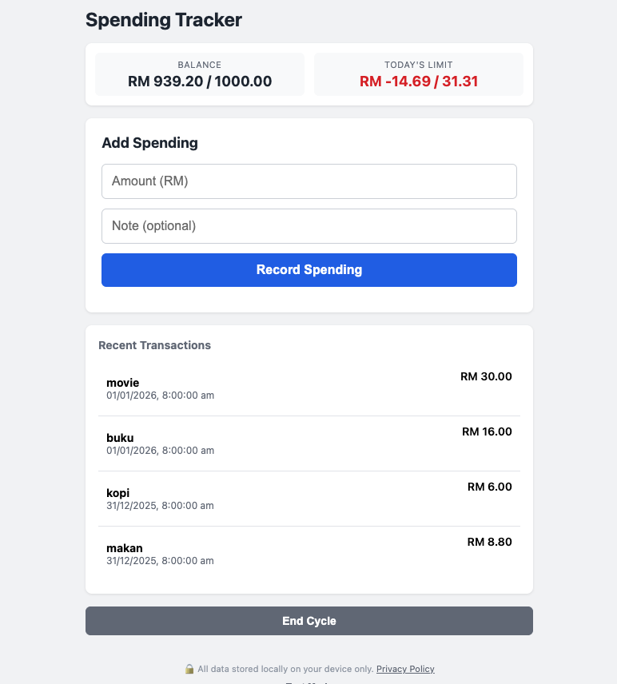
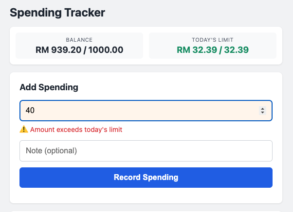

# 💰 Spending Tracker

A simple, privacy-focused Progressive Web App (PWA) for tracking daily spending and managing budget cycles. All data is stored locally in your browser—no server, no tracking, completely private.

[](privacy.html)
[]()
[]()
[](LICENSE)

**Repository:** [github.com/suhz/spending-tracker](https://github.com/suhz/spending-tracker)

## ✨ Features

### Core Functionality
- 📊 **Cycle-based budgeting** - Set a max amount and end date for each spending cycle
- 💡 **Smart daily limits** - Automatically calculates recommended spending per day
- ⚠️ **Overspending warnings** - Visual alerts when exceeding limits
- 📝 **Transaction tracking** - Record all spending with notes
- ✏️ **Edit & delete** - Modify or remove transactions easily
- 💸 **Balance carry-forward** - Remaining balance transfers to next cycle

### Technical Features
- 🔒 **100% Private** - All data stored locally using IndexedDB
- 📱 **Progressive Web App** - Install on mobile/desktop, works offline
- 🎨 **Clean UI** - Compact, focused design
- ⚡ **No dependencies** - Pure HTML/CSS/JavaScript

## 🚀 Demo & Installation

**Live Demo:** [suhz.github.io/spending-tracker/spending-tracker.html](https://suhz.github.io/spending-tracker/spending-tracker.html)

**Repository:** [github.com/suhz/spending-tracker](https://github.com/suhz/spending-tracker)

## 📸 Screenshots




## 🛠️ How It Works

### Daily Limit Calculation
```
Daily Limit = Remaining Balance ÷ Days Remaining
```

The limit adjusts automatically based on your spending:
- **Underspend** → Next day's limit increases
- **Overspend** → Next day's limit decreases
- Self-balancing system helps you stay on budget

### Example
```
Cycle: RM 1000 for 30 days
Initial daily limit: RM 33.33/day

Day 1: Spend RM 10
→ Balance: RM 990, Days left: 29
→ New daily limit: RM 34.14/day ✅

Day 2: Spend RM 50
→ Balance: RM 940, Days left: 28
→ New daily limit: RM 33.57/day ⚠️
```

## 📦 Installation

### Option 1: Use Directly (No Installation)
1. Visit the [live demo](https://suhz.github.io/spending-tracker/spending-tracker.html)
2. Or clone the repository:
   ```bash
   git clone https://github.com/suhz/spending-tracker.git
   cd spending-tracker
   ```
3. Open `spending-tracker.html` in your browser
4. Start using immediately!

### Option 2: Install as PWA
1. Open the app in your browser
2. Look for "Install" prompt or menu option
3. Click to install on your device
4. Use like a native app, even offline

### Option 3: Deploy to Web
Deploy these 4 files to any static hosting:

```
spending-tracker.html
privacy.html
manifest.json
sw.js
```

**Hosting Options:**
- [GitHub Pages](https://pages.github.com/) (Free)
- [Netlify](https://www.netlify.com/) (Free)
- [Vercel](https://vercel.com/) (Free)
- Any static file hosting

## 🎯 Usage Guide

### 1. Create Your First Cycle
- Set maximum spending amount (e.g., RM 3000)
- Set end date (e.g., 30 days from now)
- Click "Start Cycle"

### 2. Track Daily Spending
- Enter amount and optional note
- Click "Record Spending"
- Orange warning appears if exceeding daily limit (you can still proceed)

### 3. View Your Progress
- **Balance** - Shows remaining / total
- **Today's Limit** - Shows remaining / recommended for today

### 4. Manage Transactions
- Hover over any transaction to see edit/delete icons
- Click ✏️ to edit amount
- Click 🗑️ to delete transaction

### 5. End Cycle
- Click "End Cycle" when ready for next period
- Remaining balance carries forward to new cycle

### 🧪 Test Mode (For Testing)
- Click "Toggle Test Mode" at bottom
- Set any date to simulate spending on different days
- Perfect for testing the dynamic limit calculation

## 🔒 Privacy & Security

### What We Collect
**Nothing.** Seriously.

### How Data is Stored
- All data stored in **IndexedDB** (built into your browser)
- Data never leaves your device
- No server, no backend, no database we control
- Each browser has its own isolated data

### Data Ownership
- You own 100% of your data
- Delete anytime by clearing browser data
- No account needed, no password to remember

[Read Full Privacy Policy](privacy.html)

## 🏗️ Technical Details

### Stack
- **Frontend**: Vanilla HTML/CSS/JavaScript (no frameworks)
- **Storage**: IndexedDB
- **PWA**: Service Worker for offline support

### Browser Support
- ✅ Chrome/Edge (Chromium)
- ✅ Safari (iOS/macOS)
- ✅ Firefox
- ✅ Any modern browser with IndexedDB support

### File Structure
```
├── spending-tracker.html    # Main app
├── privacy.html             # Privacy policy page
├── PRIVACY.md              # Privacy policy (markdown)
├── manifest.json           # PWA manifest
├── sw.js                   # Service worker
└── README.md              # This file
```

### Database Schema

**Cycles Table:**
```javascript
{
  id: number (auto-increment),
  max_amount: number,
  start_date: string (ISO),
  end_date: string (ISO),
  is_active: number (0 or 1)
}
```

**Transactions Table:**
```javascript
{
  id: number (auto-increment),
  cycle_id: number,
  amount: number,
  date: string (ISO),
  note: string
}
```

## 🤝 Contributing

Contributions welcome! Here are some ideas:

### Feature Ideas
- [ ] Multiple account
- [ ] Multiple currencies
- [ ] Spending categories
- [ ] Export data to CSV/Excel
- [ ] Charts/graphs
- [ ] Budget templates
- [ ] Recurring transactions
- [ ] Dark mode

### How to Contribute
1. Fork the repository: [github.com/suhz/spending-tracker](https://github.com/suhz/spending-tracker)
2. Create your feature branch (`git checkout -b feature/AmazingFeature`)
3. Commit your changes (`git commit -m 'Add some AmazingFeature'`)
4. Push to the branch (`git push origin feature/AmazingFeature`)
5. Open a Pull Request

## 📝 License

This project is open source and available under the [MIT License](LICENSE).

## 👤 Author

**Suhaimi Amir** ([@suhz](https://github.com/suhz))

## 🙏 Acknowledgments

- Built with privacy in mind
- No external dependencies or frameworks
- Inspired by the need for simple, private budget tracking

## 📧 Contact

**Suhaimi Amir**

- Email: spending-tracker@suhz.net
- Threads: [@suhz.me](https://www.threads.com/@suhz.me)
- GitHub Issues: For bugs and feature requests
- Pull Requests: Contributions welcome

---

**Made with ❤️ for privacy-conscious budgeters by Suhaimi Amir ([@suhz](https://github.com/suhz))**

⭐ Star this repo if you find it useful!
